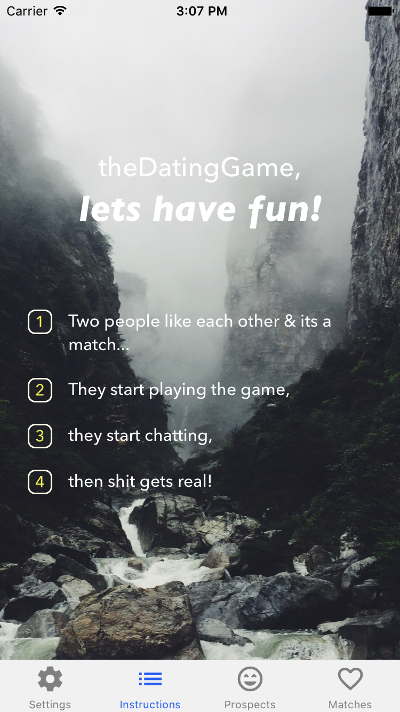

# The Dating Game

The Dating Game is a mobile dating app that reimagines the mobile dating experience. Like other dating apps, users will be able to match and chat with other users in their area. However, after matching, the two users will be prompted with a game to play as an ice breaker.

### Built by:
**Chris Comings**,
**Joseph Fiume**,
**Ryan Rolfes**,
**Younis Hamalawy**


## Background and Overview

Modern dating apps are increasingly popular among young adults with busy lifestyles. Dating apps save time and effort by providing users with a list of other singles in their area that meet certain criteria - typically being within an age range and being of a specified gender. On almost all dating apps, when two users like each other, the app notifies the pair and a chat function is made available. Herein lies the problem: how do you start a conversation with an internet stranger that doesn't sound ridiculous, boring, repetitive, disingenuous, etc?

The dating game solves this issue by prompting matches to play simple, yet conversation inducing games with one another. We view the term "dating" apps as a misnomer - these are introduction apps. Our goal is to provide our users with a better way to get to know each other by breaking the ice for them, in a fun and organic way.

Our approach:
  * Allow users to create a profile and specify the gender and age range of prospects
  * Match users who fit each others' specified criteria and live in the same city
  * Prompt them to play a fun, yet simple game to organically provide a conversation starter
  * Provide them with full chat functionality to get to know one another



  ### Functionality & MVP   
  - [ ] Learn and implement a MERNN stack (Mongo DB, Express, React-Native, Node.js)
  - [ ] OAuth
  - [ ] Sign up users that create a profile and specify prospect criteria
  - [ ] Users can be matched with other users

  #### Bonus Features
  - [ ] Allow chat functionality between users
  - [ ] Users can play games
  - [ ] Users can add multiple photos
  - [ ] Users can play additional rounds

# Technology

## Backend
The Dating Game runs on Express, Node.js and MongoDB.
Both Express and Node.js are written in JavaScript.
MongoDB is a NoSQL database.
## Frontend
The Dating Game utilizes React Native to run on Mac-iOS.
React Native is also written in JavaScript.
## npm
Node package manager (npm) is used to install all of the frontend and backend dependencies.

# Code Snippets

``` javascript

```

## Future Implementations

### Chats
Users will be able to chat with each other.

### Matches
Users will be matched with each other.

### Games
Users can play games with their matched counterparts.
Users will be able to play multiple rounds of a game.

### Photos
Users will be able to upload multiple photos to promote better matches.

### Tests
Full frontend and backend tests with automation.
