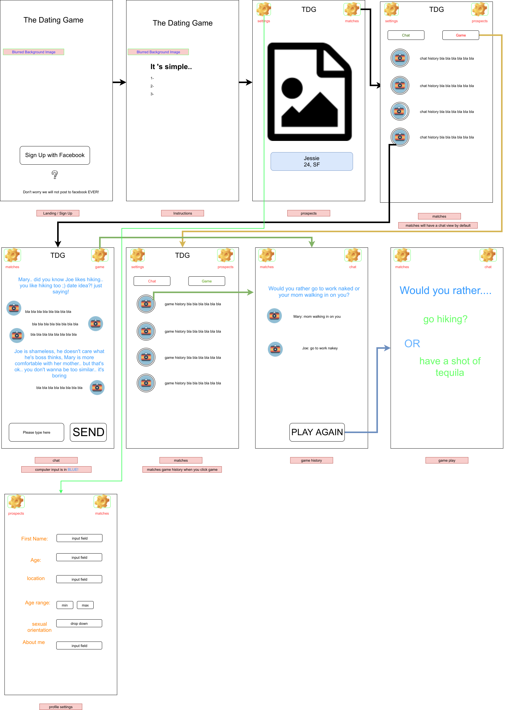

# The Dating Game

The Dating Game is a mobile dating app that reimagines the mobile dating experience. Like other dating apps, users will be able to match and chat with other users in their area. However, after matching, the two users will be prompted with a game to play as an ice breaker.

## Background and Overview

Modern dating apps are increasingly popular among young adults with busy lifestyles. Dating apps save time and effort by providing users with a list of other singles in their area that meet certain criteria - typically being within an age range and being of a specified gender. On almost all dating apps, when two users like each other, the app notifies the pair and a chat function is made available. Herein lies the problem: how do you start a conversation with an internet stranger that doesn't sound ridiculous, boring, repetitive, disingenuous, etc?

The dating game solves this issue by prompting matches to play simple, yet conversation inducing games with one another. We view the term "dating" apps as a misnomer - these are introduction apps. Our goal is to provide our users with a better way to get to know each other by breaking the ice for them, in a fun and organic way.

Our approach:
  * Allow users to create a profile and specify the gender and age range of prospects
  * Match users who fit each others' specified criteria and live in the same city
  * Prompt them to play a fun, yet simple game to organically provide a conversation starter
  * Provide them with full chat functionality to get to know one another

## Functionality & MVP   
   - [ ] Learn and implement a MERNN stack (Mongo DB, Express, React-Native, Node.js)
   - [ ] Sign up users that create a profile and specify prospect criteria
   - [ ] Users can be matched with other users
   - [ ] Allow chat functionality between users

#### Bonus Features
   - [ ] OAuth
   - [ ] Users can play games
   - [ ] Users can add multiple photos
   - [ ] Users can play additional rounds

### Wireframes

## Technologies & Technical Challenges
  ##### Backend: Mongo/Express/Node.js
  ##### Frontend: React Native

#### Composing our data
  + ##### Users
    + Users create profiles and enter their basic info and preferences
    + For basic info: email, password, name, age, zip location, sexual preference, gender
    + For preferences: city, gender, age range, hobbies(choose from a list)

  + ##### Games
    + For our first game, we are implementing "Would You Rather?"
    + Implement a list of game questions and store the results with the user's information

  + #### Backend
    + Our backend will be a Mongo DB with an Express framework written in Node.js
    + The backend will match users and create a chat
    + The backend will handle the chat functionality and storage of chat history

## Accomplished over the Weekend
 - Identified our Technologies and watched classes on setting it up
 - Completed a React Native tutorial and created a skeleton
 - Completed an Express tutorial and created a skeleton
 - Completed a basic design of the app and it's main features (wire frames)

## Group Members & Work Breakdown

**Chris Comings**,
**Joseph Fiume**,
**Ryan Rolfes**,
**Younis Hamalawy**

### Day 1
  - Set up backend AUTH (potentially OAuth)
  - Set up front end and build components and views for sign in/up

### Day 2
  - Finalize and test AUTH
  - Finalize and test frontend sign in/up

### Day 3
  - Create an index of prospects for a user based on specified age, location, and gender filters

### Day 4
  - Build and test front and back end for chat functionality

### Day 5, 6
  - Implement matching and user notifications for a match
  - Finalize and test chat functionality
  - Add ability for matches to play games

### Day 7
 - Production Read me
 - Improve UX
 - Seed the database
